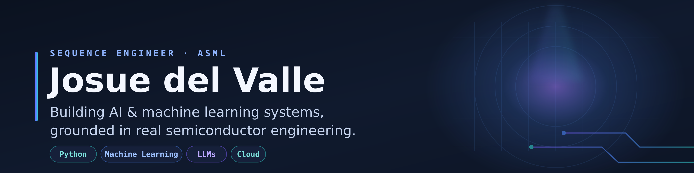

# Hi, I'm Josue 👋

I'm a **Sequence Engineer at [ASML](https://www.asml.com/)** in Eindhoven, where I turn complex system requirements into safe, scalable, and efficient workflows for manufacturing and field service. I enjoy solving technical challenges, simplifying complexity, and improving operational readiness.

I'm now channelling that engineering background into **AI and machine learning** — building systems that don't just call a model, but reason, orchestrate, and solve real problems. My goal is simple: combine deep, real-world domain knowledge with strong software and ML engineering.

📍 Eindhoven, Netherlands &nbsp;·&nbsp; 💬 English / Español

---

## 🔧 What I work with

`Python` &nbsp; `SQL` &nbsp; `Machine Learning` &nbsp; `Data Science` &nbsp; `LLMs` &nbsp; `Cloud (AWS)` &nbsp; `Git`

## 🚀 Projects

> 🛠️ _In progress — building a portfolio of applied AI projects. Check back soon._

<!--
Project cards will go here as they ship. Planned:
- AI-powered personal finance assistant (transaction categorisation + agentic reasoning)
- Machine/sequence diagnostic dashboard (ML + LLM fault explanation)
- Cloud-deployed RAG system
-->

## 🎓 Background & certifications

A selection of completed training that backs up the skills above:

- **Mathematics for Machine Learning and Data Science** — DeepLearning.AI ([verify](https://www.coursera.org/account/accomplishments/specialization/certificate/JGHSXXZJ5LY6))
- **Python 3 Programming Specialization** — University of Michigan ([verify](https://coursera.org/share/40d1e9f3d4cc387b7693ce97c15613ea))
- **Data Scientist with Python** — DataCamp ([verify](https://www.datacamp.com/statement-of-accomplishment/track/184002387af8d6c575ee415bed90a0716104d7a5))
- **SQL Associate** — DataCamp ([verify](https://www.datacamp.com/certificate/SQA0012572108883))
- **AWS Cloud Practitioner Essentials** — AWS ([verify](https://www.coursera.org/account/accomplishments/verify/6PWVMV2SVF9W))
- **Power BI Fundamentals** — DataCamp ([verify](https://www.datacamp.com/statement-of-accomplishment/track/9bb75474c4df843f530ab7b77c7db5026ece662f))
- **GitHub Foundations** — GitHub ([verify](https://www.credly.com/badges/a816188a-6d9f-467f-b915-99ff4b6b2a07/public_url))

## 🌱 Currently exploring

Machine Learning Specialization (DeepLearning.AI) · LLM & agent engineering (LangChain, RAG) · frontend foundations (TypeScript, React)

## 🤝 Connect

