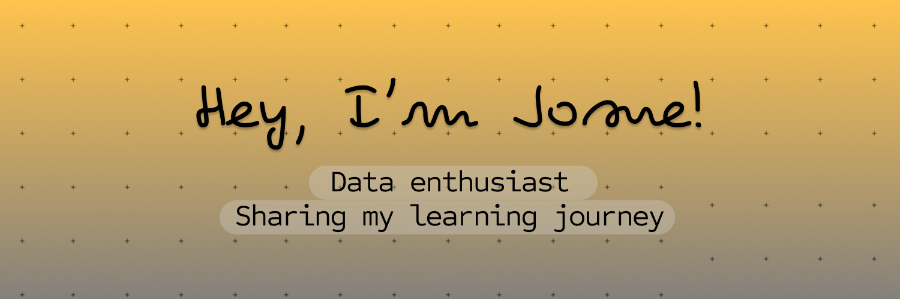

# Hi there, I´m Josue! 👋

    <em>
        An <b>Electronics Engineer</b> 💡 and <b>Machine Learning enthusiast</b> 🧠, with over three years of experience in the automotive industry. My expertise lies in developing automated solutions for software testing, improving project efficiency and reducing time-cost 🚀.
    </em> 

- 🌱 I’m currently learning <a href="https://www.coursera.org/specializations/mathematics-for-machine-learning-and-data-science"> <b>Mathematics for Machine Learning and Data Science</b></a> by DeepLearning.AI

### 🛠️ Skills
- 🐍 Python
- 📊 Pandas
- 📈 Matplotlib
- 🤖 Scikit-learning

### 🤝 Connect with me

